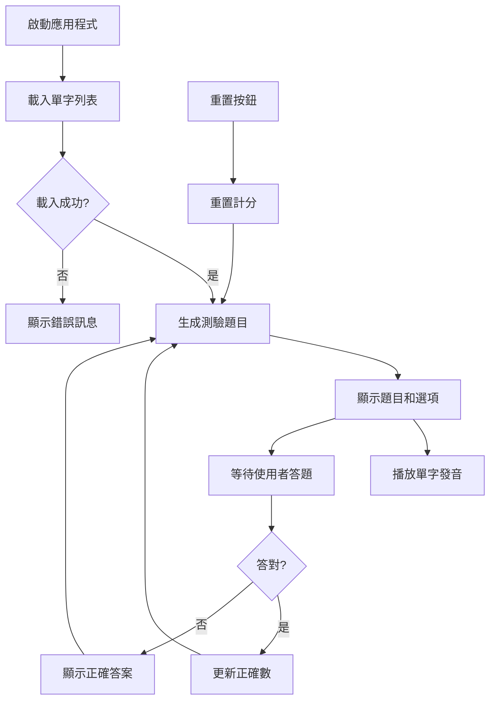
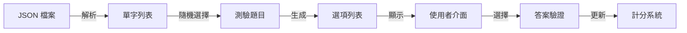

# 單字測驗應用程式

這是一個 iOS 單字測驗應用程式，幫助使用者透過測驗方式學習英文單字。

## 功能特點

- 從 JSON 檔案載入單字列表
- 隨機生成測驗題目
- 語音播放單字發音
- 即時顯示答題結果
- 追蹤答題正確率
- 支援重置測驗

## 系統架構

## 資料流程

## 技術細節

- 使用 `AVSpeechSynthesizer` 實現語音功能
- 使用 `Result` 類型處理錯誤情況
- 使用 `UIAlertController` 顯示錯誤訊息
- 使用 `JSONDecoder` 解析單字資料

## 使用方式

1. 啟動應用程式
2. 等待單字列表載入
3. 點擊播放按鈕聽取單字發音
4. 選擇認為正確的答案
5. 查看答題結果
6. 使用重置按鈕重新開始測驗

## 系統需求

- iOS 14.0 或更新版本
- Xcode 12.0 或更新版本
- Swift 5.0 或更新版本 